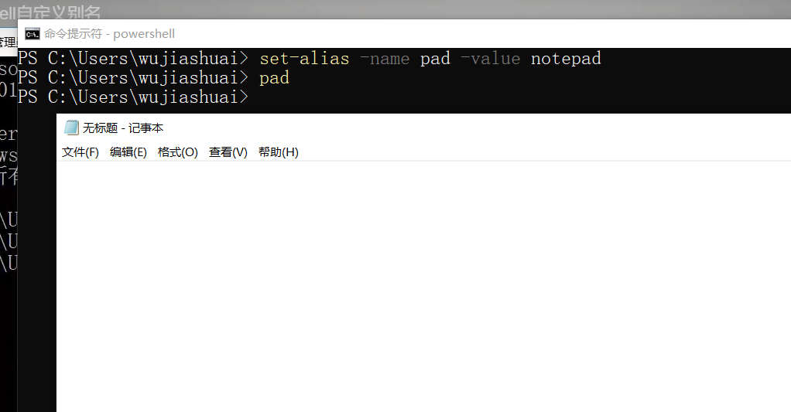

# 外部命令

powershell 可以通过cmd进行执行外部命令，比如直接启动一些服务，

如nginx服务

```
PS C:\Users\wujiashuai\Downloads\nginx-1.19.1\nginx-1.19.1> start nginx
PS C:\Users\wujiashuai\Downloads\nginx-1.19.1\nginx-1.19.1>
```

#### 通过IPConfig查看自己的网络配置

```powershell
PS C:\PS> ipconfig

Windows IP Configuration

Ethernet adapter Local Area Connection:

   Connection-specific DNS Suffix  . : www.mossfly.com
   Link-local IPv6 Address . . . . . : fe80::b9dd:91e33:33f0:7885%10
   IPv4 Address. . . . . . . . . . . : 192.168.140.100
   Subnet Mask . . . . . . . . . . . : 255.255.252.0
   Default Gateway . . . . . . . . . : 192.168.140.1

Tunnel adapter isatap.www.mossfly.com:

   Connection-specific DNS Suffix  . : www.mossfly.com
   Link-local IPv6 Address . . . . . : fe80::5efe:192.168.140.100%11
   Default Gateway . . . . . . . . . :

Tunnel adapter Teredo Tunneling Pseudo-Interface:

   Media State . . . . . . . . . . . : Media disconnected
   Connection-specific DNS Suffix  . :
```

# 命令集

命令集合，相当于是cmd命令的扩展，cmd命令少的可怜。因此推出了命令集合来对cmd命令进行扩展


# 别名

通过别名，我们可以很简单的执行一些语句，方便记忆与执行。


创建别名

```
set-alias -name pad -value notepad
```



删除别名

```
del alias:pad
```

保存别名

```
export-alias demo.psone
```

导入别名

```
import-alias -force demo.psone
```

force是强制导入

# 执行文件和脚本

## bat脚本

这个是批处理文件，格式如下

```
@echo off
...
pause
```


含义，`@echo off`表示执行了这条命令后关闭所有命令(包括本身这条命令)的回显。而`echo off`命令则表示关闭其他所有命令(不包括本身这条命令)的回显，`@`的作用就是关闭紧跟其后的一条命令的回显，