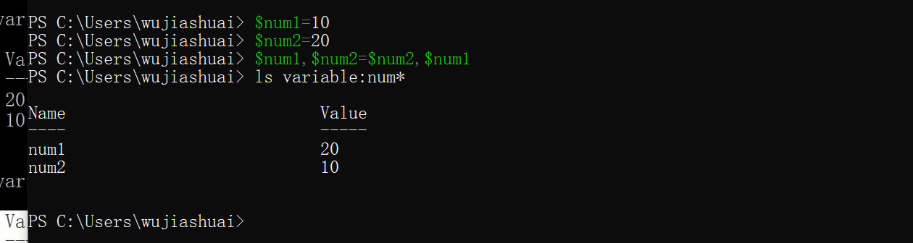
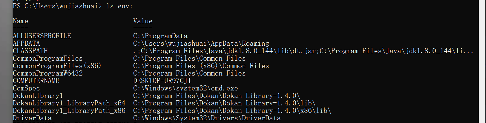
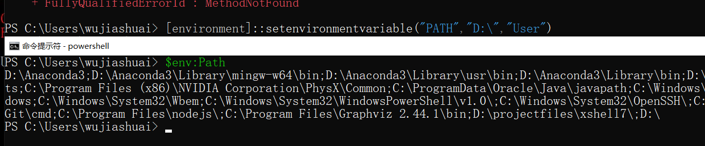

# 变量赋值

这里的设置变量和C语言里面的指针类似，



其中`num1`是指针，`$num1`是指向指针的内存地址，我们是对这个内存地址进行操作的。

赋值操作符为“=”，几乎可以把任何数据赋值给一个变量，甚至一条cmdlet命令，为什么，因为Powershell支持对象，对象可以包罗万象。


## 查看变量

```
PS C:\Users\wujiashuai> ls variable:num1

Name                           Value
----                           -----
num1                           20
```

powershell对大小写不敏感。powershell对变量更加灵活，可以很随意

```powershell
PS C:\Users\wujiashuai> ${"i am a " var ()}='aaaa'
PS C:\Users\wujiashuai>  ${"i am a " var ()}
aaaa
```

支持算数运算式

```powershell
PS C:\Users\wujiashuai> $n=1+2+3
PS C:\Users\wujiashuai> $n
6
```

一次性赋值多个变量

```powershell
PS C:\Users\wujiashuai> $num1=$num2=$num3=34
PS C:\Users\wujiashuai> $num1
34
PS C:\Users\wujiashuai> $num2
34
PS C:\Users\wujiashuai>
PS C:\Users\wujiashuai> $num3
34
```

## 变量写保护

```
PS C:\test> New-Variable num -Value 100 -Force -Option readonly
```

赋值之后，不能再进行操作

## 查看变量类型

```
GetType().Name
```

比如

```powershell
PS> (10).gettype().name
Int32
PS> (9999999999999999).gettype().name
Int64
PS> (3.14).gettype().name
Double
PS> (3.14d).gettype().name
Decimal
PS> ("WWW.MOSSFLY.COM").gettype().name
String
PS> (Get-Date).gettype().name
DateTime
```

## 弱类型变量

通过系统自动判断，输入是什么类型，这样子也有会出现问题

Powershell会给数据分配一个最佳的数据类型；如果一个整数超出了32位整数的上限([int32]::MaxValue),它就会分配一个64位整数的数据类型；如果碰到小数，会分配一个Double类型；如果是文本，Powershell会分配一个String类型；如果是日期或者时间，会被存储为一个Datetime对象。

## 强类型变量

就是通过手动去指定数据类型

定义变量时可以在变量前的中括号中加入数据类型。例如定义一个Byte类型的变量

```powershell
PS C:\Users\wujiashuai>  [byte]$b=101
PS C:\Users\wujiashuai>  [String]$d="wujiashuai"
PS C:\Users\wujiashuai>  [int]$c=123
PS C:\Users\wujiashuai> $b
101
PS C:\Users\wujiashuai> $c
123
PS C:\Users\wujiashuai> $d
wujiashuai
```


# 变量操作

查看变量是否存在

```powershell
test-path variable:num1
```

删除变量

```
del variable:num1
```
# 特殊变量

## 自动化变量

Powershell 自动化变量 是那些一旦打开Powershell就会自动加载的变量。
这些变量一般存放的内容包括

1. **用户信息**：例如用户的根目录$home
2. **配置信息**:例如powershell控制台的大小，颜色，背景等。
3. **运行时信息**：例如一个函数由谁调用，一个脚本运行的目录等。


系统环境变量

| 命令 | 含义             |
| ---- | ---------------- |
| `$$` | 上一次执行的命令 |

```
PS C:\Users\wujiashuai> $num1
2
PS C:\Users\wujiashuai> $$
$num1
```

| 命令 | 含义                 |
| ---- | -------------------- |
| `$?` | 上一次运行命令的状态 |

```
PS C:\Users\wujiashuai> $?
True
```

## 环境变量

打印全部环境变量



打印环境变量中的一个变量

```
PS C:\Users\wujiashuai> $env:TEMP
C:\Users\WUJIAS~1\AppData\Local\Temp
```

创建暂时环境变量


删除环境变量

```
del env:university
```

用户变量永久生效

```powershell
[environment]::setenvironmentvariable("PATH","D:\","User")
```




## 驱动器变量


## 变量的作用域

**$global**
全局变量，在所有的作用域中有效，如果你在脚本或者函数中设置了全局变量，即使脚本和函数都运行结束，这个变量也任然有效。

**$script**
脚本变量，只会在脚本内部有效，包括脚本中的函数，一旦脚本运行结束，这个变量就会被回收。

**$private**
私有变量，只会在当前作用域有效，不能贯穿到其他作用域。

**$local**
默认变量，可以省略修饰符，在当前作用域有效，其它作用域只对它有只读权限。

打开Powershell控制台后，Powershell会自动生成一个新的全局作用域。如果增加了函数和脚本，或者特殊的定义，才会生成其它作用域。在当前控制台，只存在一个作用域，通过修饰符访问，其实访问的是同一个变量：

