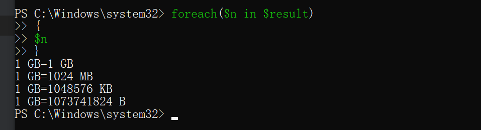
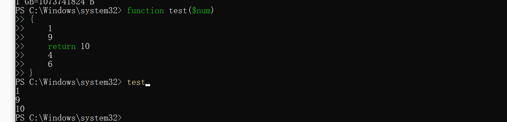

# 函数体

函数的结构由三部分组成：函数名，参数，函数体

```powershell
Function FuncName (args[])
{
      code;
}
```

如果没有参数，则可以省掉括号

```powershell
Function FuncName
{
      code;
}
```

# 参数

## 设置参数名称

```powershell
function StringContact($str1,$str2)
{
    return $str1+$str2
}
 
StringContact moss fly
StringContact -str1 word -str2 press
mossfly
wordpress
```

## 参数定义默认值

```powershell
function stringContact($str1="moss",$str2="fly")
{
    return $str1+$str2
}
stringContact Good Luck
stringContact
```

## 强类型参数

```powershell
PS C:\Windows\system32> function subtract([int]$value1,[int]$value2)
>> {
>>     return $value1-$value2
>> }
PS C:\Windows\system32> subtract moss fly
subtract : 无法处理对参数“value1”的参数转换。无法将值“moss”转换为类型“System.Int32”。错误:“输入字符串的格式不正
确。”
所在位置 行:1 字符: 10
+ subtract moss fly
+          ~~~~
    + CategoryInfo          : InvalidData: (:) [subtract]，ParameterBindingArgumentTransformationException
    + FullyQualifiedErrorId : ParameterArgumentTransformationError,subtract

PS C:\Windows\system32> subtract  1 3
-2
```

# 函数返回值

## 一个返回值

```
function Square([double]$num)
{
    return $num*$num
}
#在控制台输出结果
Square 9.87
#97.4169
 
#将结果赋值给变量
$value=Square 9.87
$value
#97.4169
```


## 多个返回值

````
function gbMeasure($amount)
{
    "$amount GB=$($amount) GB"
    "$amount GB=$($amount*1gb/1mb) MB"
    "$amount GB=$($amount*1gb/1kb) KB"
    "$amount GB=$($amount*1gb) B"
}
 
#函数返回4个值
gbMeasure 1
# 1 GB=1 GB
# 1 GB=1024 MB
# 1 GB=1048576 KB
# 1 GB=1073741824 B
#将所有的返回值存储在一个变量中
$result=gbMeasure 1
$result

````

$result就是一个列表



## Return语句

Powershell会将函数中所有的输出作为返回值，但是也可以通过return语句指定具体的我返回值。Return 语句会将指定的值返回，同时也会中断函数的执行，return后面的语句会被忽略。



## 消除输出


```
Function Test()
{
    Write-Host "Try to calculate."
    "3.1415926"
    Write-Host "Done."
}
```

```
PS C:\Users\wujiashuai> $n=Test
Try to calculate.
Done.
PS C:\Users\wujiashuai> $n
3.1415926
```

可以很明显的看出来，我们只返回了我们所需要的。

## 使用调试模式

可能输出这些函数中具有临时提示信息，那么给函数的返回值会造成干扰，要解决上述的问题，那么就需要使用`write-debug`命令

```
Function Test()
{
    Write-Debug "Try to calculate."
    "3.1415926"
    Write-Debug "Done."
}
# Debug调试信息只会在调试模式下被输出
$value=Test
# 3.1415926
 
#如果你想通过显示调试信息调试函数，可以开启调试模式
$DebugPreference="Continue"
$value=Test
# 调试: Try to calculate.
# 调试: Done.
 
# 测试返回值
$value
# 3.1415926
 
#如果关闭调试模式，这些调试信息自然不会输出
$DebugPreference="SilentlyContinue"
$value=Test
```

## 抑制错误信息

虽然错误信息，只是会显示出来，但是这个是不影响其他因素的。

```powershell
Function ErrorTest()
{
    #从这里开始隐藏所有的错误信息
    $ErrorActionPreference="SilentlyContinue"
    Stop-Process -Name "www.mossfly.com"
    #该进程不存在
 
    #恢复$ErrorActionPreference,错误开始输出
    $ErrorActionPreference="Continue"
 
    2/0
}
ErrorTest
```

