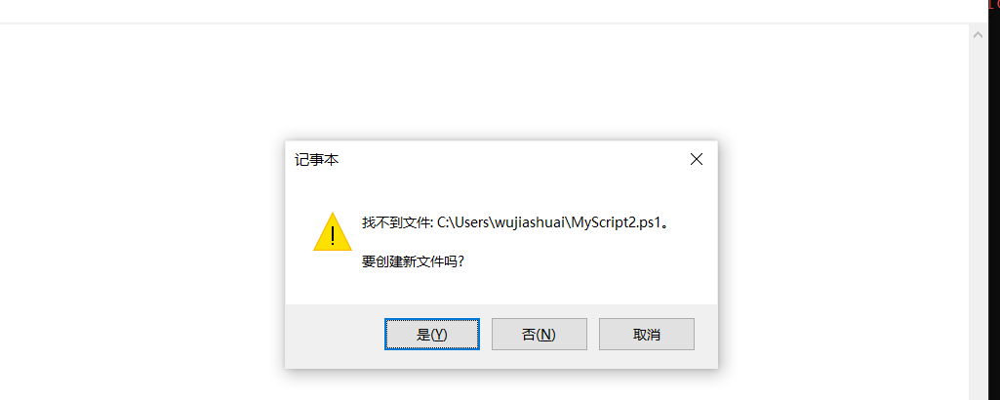

# 编写脚本

## 通过编辑器创建脚本

可以直接在Powershell控制台中打开Notepad

```
PS E:> notepad.exe .\MyScript.ps1
PS E:> notepad.exe
```



使用`.\脚本名称`的方式进行运行，但是前提是需要修改策略的

查看执行策略

```powershell
get-executionpolicy
```

修改执行策略

```
PS C:\Windows\system32> Set-ExecutionPolicy AllSigned
```

查看执行后的策略

```
PS C:\Windows\system32> get-ExecutionPolicy
AllSigned
```

直接运行脚本

```
PS C:\Windows\system32> demo.ps1
```