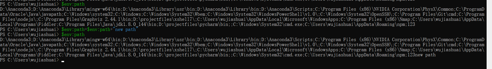

# 管道符

这里的管道符和liux中的管道符是一样的，都是将前面一个命令的输出，作为一个文件的形式传输给第二个命令的输入。简单的来讲第二个命令得到的是一个文件输入。

```powershell

PS C:\Users\wujiashuai> ls | format-table LastWriteTime,name

LastWriteTime       Name
-------------       ----
2020/8/29 11:50:59  .android
2020/10/21 13:53:39 .astropy
2020/10/12 10:44:22 .cisco
2020/10/13 12:33:47 .conda
2020/11/3 21:54:35  .config
2020/8/5 5:53:16    .fiddler
2020/11/5 10:44:29  .gitbook
2020/8/1 18:07:25   .idlerc
2020/10/28 10:50:38 .ipynb_checkpoints
2020/10/12 14:07:15 .ipython
2020/10/14 9:22:08  .jupyter
```


# 环境变量

我们如何执行外部命令，有两个条件:

+ `&"program"`，即将可执行文件用双引号括起来，前面再加一个`&`即可
+ 将环境添加到系统路径中




